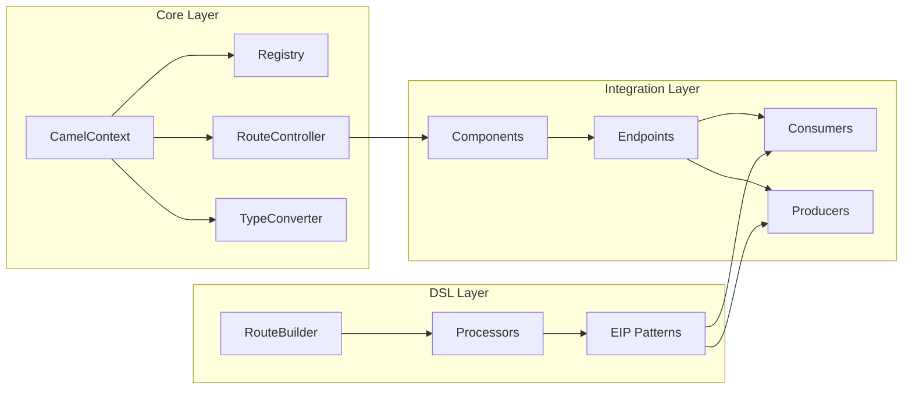
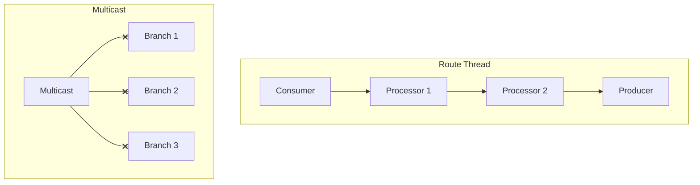

# Architecture

## Vue d'ensemble

GoCamel suit une architecture modulaire inspirée d'Apache Camel mais adaptée aux idiomes Go.



## Couches

### 1. Core Layer

Le cœur de GoCamel, indépendant des transports:

- **CamelContext** — Conteneur de routes et composants
- **Registry** — Registre des composants nommés
- **Exchange** — Conteneur de message en transit
- **Message** — Corps + Headers du message

```go
// Création manuelle
camelCtx := &gocamel.CamelContext{}
camelCtx.Initialize()
```

### 2. Integration Layer

Les composants de communication:

```
Component → Endpoint → {Consumer | Producer}
```

**Exemple de flux:**

```go
// Création chaînée
component := gocamel.NewHTTPComponent()
ctx.AddComponent("http", component)

endpoint, _ := ctx.CreateEndpoint("http://localhost:8080/api")
consumer, _ := endpoint.CreateConsumer(processor)
producer, _ := endpoint.CreateProducer()
```

### 3. DSL Layer

L'API fluent pour construire les routes:

```
From("...")
    .[Processor]()
    .[EIP Pattern]()
    .To("...")
```

## Patterns de conception

### Factory Pattern

```go
// Component factory
compFactories := map[string]func() gocamel.Component{
    "http":  gocamel.NewHTTPComponent,
    "file":  gocamel.NewFileComponent,
    "timer": gocamel.NewTimerComponent,
}
```

### Builder Pattern

```go
// Route construction fluente
route := builder.
    From("direct:start").
    SetHeader("X-Id", uuid.New().String()).
    ProcessFunc(transform).
    To("direct:end").
    Build()
```

### Strategy Pattern

Les EIP utilisent le Strategy Pattern:

```go
type Splitter interface {
    Split(*Exchange) (any, error)
}

type AggregationStrategy interface {
    Aggregate(oldExchange, newExchange *Exchange) *Exchange
}
```

## Concurrency

GoCamel exploite les goroutines Go:



Les branches Multicast s'exécutent en **parallèle** si configuré:

```go
builder.Multicast().ParallelProcessing(). ...
```

## Extension Points

### Custom Component

```go
type MyComponent struct{}

func (c *MyComponent) CreateEndpoint(uri string) (Endpoint, error) {
    return &MyEndpoint{uri: uri}, nil
}

// Enregistrement
ctx.AddComponent("myproto", &MyComponent{})
```

### Custom Processor

```go
func MyProcessor(exchange *gocamel.Exchange) error {
    // Logique personnalisée
    return nil
}

builder.From("...").ProcessFunc(MyProcessor).To("...")
```
