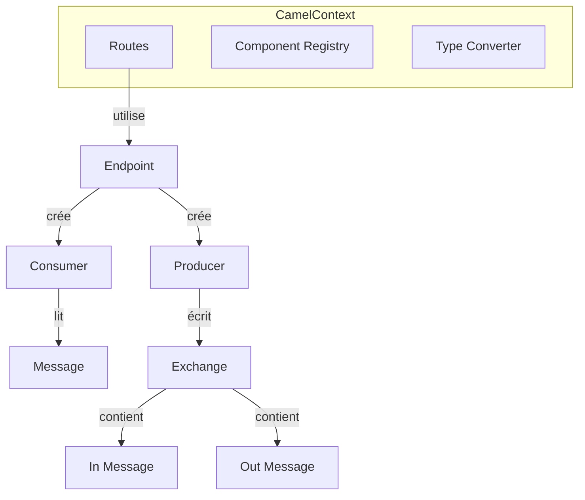
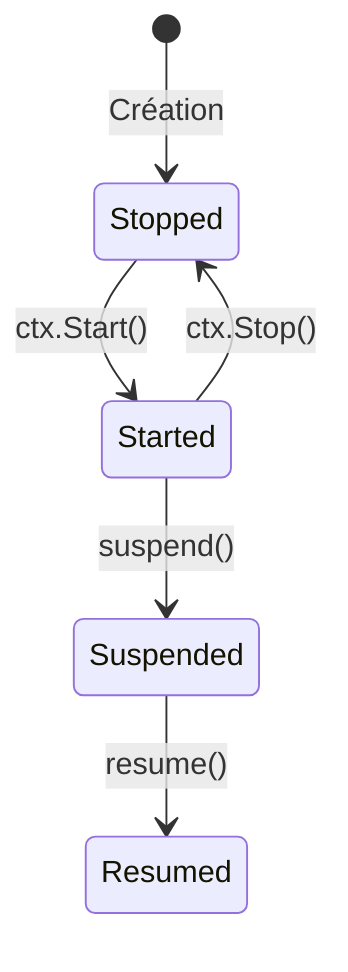

# Concepts

## Architecture de base



## Core Concepts

### CamelContext

Le **CamelContext** est le cœur de GoCamel. Il gère:

- Le registre des composants
- La collection des routes
- Le cycle de vie (start/stop)
- Les convertisseurs de type

```go
ctx := gocamel.NewCamelContext()
defer ctx.Stop()
```

### Exchange

Un **Exchange** encapsule un message en transit:

- **In**: Message entrant
- **Out**: Message sortant (résultat)
- **Properties**: Métadonnées de l'échange
- **Exception**: Erreur éventuelle

```go
exchange := gocamel.NewExchange(context.Background())
exchange.GetIn().SetBody("Hello")
exchange.GetIn().SetHeader("Content-Type", "text/plain")
```

### Route

Une **Route** définit le chemin d'un message:

```
from(endpoint) → [processors] → to(endpoint)
```

```go
route := builder.
    From("timer:tick").
    SetBody("Hello").
    To("log:output").
    Build()
```

### Component

Un **Component** est une fabrique d'endpoints:

| Composant | Rôle |
|-----------|------|
| Direct | Routage synchrone in-memory |
| Timer | Déclenchement périodique |
| File | Lecture/écriture fichiers |
| HTTP | Client/serveur HTTP |
| FTP/SFTP | Transfert de fichiers |

### Processor

Un **Processor** transforme un échange:

```go
type MyProcessor struct{}

func (p *MyProcessor) Process(exchange *gocamel.Exchange) error {
    body := exchange.GetIn().GetBody()
    // Transform...
    exchange.GetOut().SetBody(result)
    return nil
}
```

### Endpoint

Un **Endpoint** représente une extrémité de communication:

- **URI**: `scheme:context?options`
- Exemples: `file://data`, `http://localhost:8080`, `timer:tick`

## Flux de message

```
┌─────────────┐     ┌──────────┐     ┌──────────┐     ┌──────────┐
│  Consumer   │────>│   Route  │────>│ Processor│────>│ Producer │
│  (Entrée)   │     │  (DSL)   │     │(Transform│     │ (Sortie) │
└─────────────┘     └──────────┘     └──────────┘     └──────────┘
       │                    │                 │                │
       └────────────────────┴─────────────────┴────────────────┘
                         Exchange (Message + Headers + Properties)
```

## Gestion du cycle de vie

### États d'une route



### Gestion controlée

```go
// Démarrer
ctx.Start()

// Arrêter avec timeout
ctx.Stop()

// Status
totalRoutes := ctx.GetRoutesCount()
startedRoutes := ctx.GetStartedRoutesCount()
```

## Bonnes pratiques

1. **Une route = une responsabilité** — Gardez les routes focalisées
2. **Externalisez la configuration** — Utilisez les variables d'environnement
3. **Loggez intelligemment** — Utilisez `Log()` aux points clés
4. **Gérez les erreurs** — Implémentez des stratégies d'erreur
